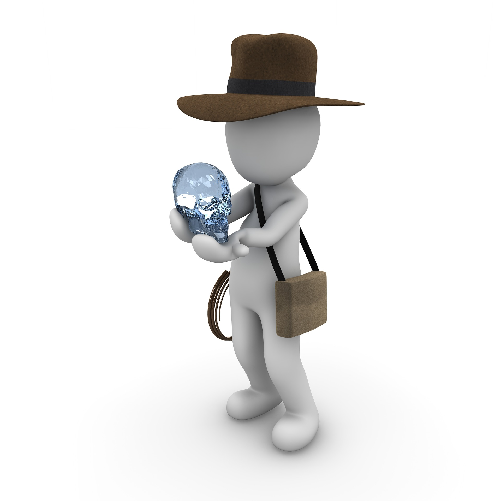

## Bio 
Je suis étudiante au Baccalauréat en Anthropologie à l'Université de Montréal, je veux devenir archéologue. J'ai un passé en informatique du c'où mon intérêt pour ce cours **FAS 1002** de `Programmation en R`. Connaître plusieurs langages de programmation surtout R pour les mathématiques et les statistiques seront un avantage dans ma future carrière d'archéologue, qui emploi de plus en plus les systèmes GIS ainsi que les bases de données pour cataloguer les artéfacts découverts. 

<aside>
{width=50%}
</aside>

## Contact

**Programme** | [Baccalauréat en Anthropologie](https://anthropo.umontreal.ca/programmes-cours/programmes-de-1er-cycle/baccalaureat-en-anthropologie/)

**Université** | [Université de Montréal](https://umontreal.ca)

**Courriel** | cynthia.bello-hernandez@umontreal.ca

